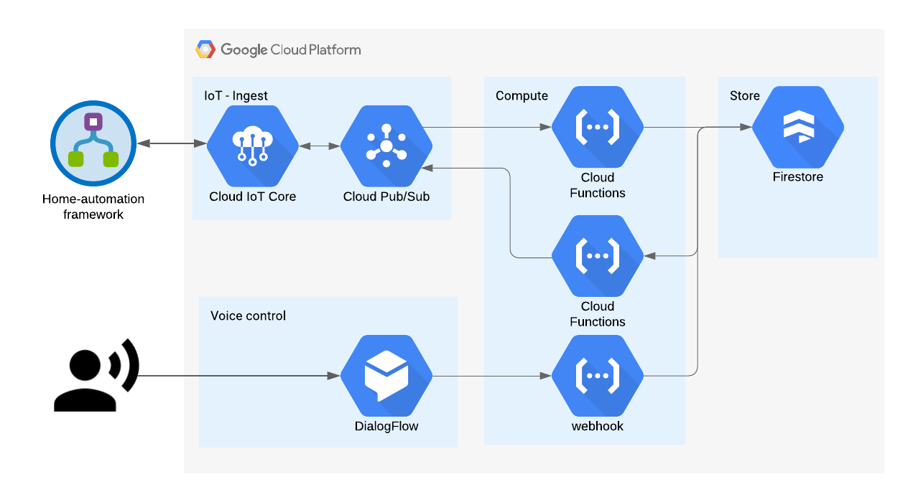

# Connected-home-cloud

**!! Very much still in construction !!**

Cloud server side of the Home-automation project. GCP is selected as the cloud provider. The main purpose of the cloud part is as an bridge my
Sonos eco-system and my IoT units. GCP enables me to talk to units using voice commands via Google Assistant which is
enabled on my Sonos network speakers.  

**Writen in:** GCP, Python, Node-js

## Repo structure

Constains the code for the cloud functions as well as setup script to reproduce GCP via the console. 